# App User Behavior Segmentation

A K-Means segmentation project with a Streamlit dashboard for exploring mobile-app usage, identifying inactive users, and planning segment-specific actions.

The current analysis covers **50,000 users**, uses **three behavioral features**, and produces **four segments**. The repository includes the analysis script, dashboard, exported CSV results, and a Word document containing dashboard screenshots.

## Contents

- [Repository structure](#repository-structure)
- [Dataset and methodology](#dataset-and-methodology)
- [Results and segment interpretation](#results-and-segment-interpretation)
- [Dashboard features](#dashboard-features)
- [Dashboard screenshots](#dashboard-screenshots)
- [Run the dashboard](#run-the-dashboard)
- [Regenerate the analysis](#regenerate-the-analysis)
- [CSV output reference](#csv-output-reference)
- [Interpretation and limitations](#interpretation-and-limitations)
- [Author](#author)

## Repository structure

Keep the scripts and dashboard document in the repository root, with the exported CSV files in **`results/`**. The folder name is plural because the scripts use that exact path.

```text
App-User-Behavior-Segmentation/
├── README.md
├── Masterfile_final.py
├── Dashboard.py
├── Dashboard output.docx
├── images/                         # Dashboard screenshots used below
└── results/
    ├── users_with_clusters.csv
    ├── cluster_profile.csv
    ├── cluster_metrics.csv
    ├── feature_set_comparison.csv
    ├── pca_modeling_comparison.csv
    ├── final_k4_stability.csv
    ├── pca_loadings.csv
    ├── df1_scaled.csv
    ├── feature_health.csv
    ├── initial_outlier_report.csv
    ├── outlier_treatment_report.csv
    ├── cluster_0_High_Users(Active_Long-Visit_Users).csv
    ├── cluster_1_Low_Users(Low-Usage_Users).csv
    ├── cluster_2_Moderate_Users(Short-Session_Users).csv
    └── cluster_3_Occasional_Users(Lapsed_Long-Session_Users).csv
```

The original `app_user_behavior_dataset.csv` is required beside `Masterfile_final.py` only when rerunning the analysis. The dashboard can run directly from the exported results without the original dataset.

View the [dashboard screenshot document](Dashboard%20output.docx), [analysis script](Masterfile_final.py), or [dashboard script](Dashboard.py). The Word document is a static record; run Streamlit to use filters and downloads.

## Dataset and methodology

The original dataset contains **50,000 rows and 25 columns**, with one unique `user_id` per row. It includes demographics, device and subscription information, session activity, feature interactions, login recency, engagement scores, and churn-risk scores.

### Final clustering inputs

| Feature | Role |
|---|---|
| `avg_session_duration_min` | Session duration |
| `daily_active_minutes` | Reported daily usage |
| `days_since_last_login` | Login recency |

Other columns support profiling, filtering, and interpretation. Engagement and churn-risk scores are not inputs to the final three-feature model.

### Processing workflow

1. Validate that user IDs are complete and unique; inspect missing values and numerical outliers.
2. Fill missing `rating_given` values with the median. Rating is not a final clustering input.
3. Preserve a reporting copy in original units before transforming model inputs.
4. Apply upper IQR capping followed by `log1p` to session duration and daily active minutes. Valid low and zero values are retained.
5. Standardize the selected features with `StandardScaler`.
6. Compare feature sets using K-Means at `k=4`, then assess cluster counts using inertia, sampled silhouette, and cluster sizes.
7. Fit the final K-Means model with `k=4`, `random_state=42`, and `n_init=10`.
8. Assign descriptive labels from observed cluster profiles and export user-level and aggregate results.
9. Use PCA to visualize the selected feature space and Streamlit to explore the results.

The final model is trained on the **three standardized behavioral features**. PCA is also examined as a modeling alternative; the two-dimensional plot is a visualization of the final clusters.

## Results and segment interpretation

The following values come from the included results, before dashboard filters are applied. Session duration and daily activity are in minutes; login gap is in days.

| Segment | Users | Session duration | Daily activity | Login gap | Inactive 30+ days |
|---|---:|---:|---:|---:|---:|
| High Users(Active Long-Visit Users) | 16,572 | 16.43 | 49.37 | 10.28 | 0.00% |
| Low Users(Low-Usage Users) | 5,598 | 13.05 | 12.76 | 21.71 | 29.99% |
| Moderate Users(Short-Session Users) | 11,717 | 4.34 | 48.81 | 22.00 | 28.43% |
| Occasional Users(Lapsed Long-Session Users) | 16,113 | 16.22 | 49.44 | 34.27 | 72.53% |

Inactivity percentages are calculated from `users_with_clusters.csv`; the other profile values come from `cluster_profile.csv`. Overall, **33.39%** of users have a login gap of at least 30 days.

### Suggested business actions

| Segment | Observed distinction | Proposed action |
|---|---|---|
| High Users(Active Long-Visit Users) | More recent logins and longer sessions relative to the short-session segment | Test personalized recommendations, advanced features, and loyalty benefits |
| Low Users(Low-Usage Users) | Lowest reported daily usage | Test simpler onboarding and relevant reminders |
| Moderate Users(Short-Session Users) | Shortest sessions | Improve early-session usefulness and content discovery |
| Occasional Users(Lapsed Long-Session Users) | Longest login gap despite comparatively long sessions | Prioritize a measured reactivation campaign |

These are proposed actions, not measured campaign outcomes. The combined labels are retained as explanatory references. Cluster numbers are model identifiers: the master script derives label assignments dynamically from cluster profiles, and its PCA legend follows `cluster_data`.

### Model evidence

| Input at k=4 | Sampled silhouette |
|---|---:|
| 11 behavioral features | 0.0692 |
| 6 behavioral features | 0.1307 |
| 4 core features | 0.2078 |
| Final 3 core features | 0.2901 |
| Final core after PCA retaining at least 90% variance | 0.2901 |

The three-feature solution has the highest silhouette among the tested direct feature sets. It also has the highest sampled silhouette among the tested cluster counts from 2 to 10, although the difference from `k=3` (0.2882) is small. Selection of four clusters combines this evidence with interpretability; it does not establish a universally optimal segmentation.

Silhouette scores use a 5,000-user sample with `random_state=42`. The two-component PCA projection retains **66.88%** of variance. The supplementary PCA comparison reports a silhouette of **0.3188** in that reduced space, but this uses a different distance space and omits about one-third of the variance. Retaining at least 90% requires all three components.

## Dashboard features

The sidebar filters users by segment, country, device, subscription type, and age. Overview and segment KPIs recalculate from the selected population. An empty selection displays a message instead of continuing calculations.

### Overview KPI cards

- Users and their share of all users
- Number of selected segments
- Average sessions per week
- Average daily active time
- Average days since login
- Inactive users with a login gap of 30+ days (%)

### Dashboard tabs

| Tab | Contents |
|---|---|
| Executive overview | Segment sizes, behavioral comparisons, and business opportunity cards |
| Segment explorer | Selected-segment KPIs, comparison with selected-user averages, recommendations, and subscription/device/marketing-source breakdowns |
| Strategy center | Segment objectives, proposed actions, monitoring suggestions, and a campaign planning table |
| Customer lookup | User-ID search, individual profiles, and selected-user CSV export |
| Model evidence | PCA scatter plot, cluster count, silhouette, smallest segment, inertia/silhouette comparison, and feature-set results |

The Segment Explorer has five cards: **Users, Session duration, Daily activity, Login gap, and Inactive users (30+ days)**. Engagement and churn-risk scores remain in supporting comparisons and customer details, but have been removed from the headline KPI cards because their segment averages differ little in the current results.

Business opportunity headings use blue for High, amber for Low, purple for Moderate, and red for Occasional users in the current dashboard code.

### Inactivity definition

```text
Inactive users (%) =
users with days_since_last_login >= 30
÷ users with a known numeric login gap
× 100
```

The overview uses all filtered users; the Segment Explorer uses only the selected segment within those filters. Missing or nonnumeric login gaps are excluded, and a population with no valid login gaps displays `N/A`. Thirty days is an explicit dashboard threshold, not a confirmed churn label.

Model-quality metrics remain global. The PCA display is filtered, but its coordinates are fitted on all users. Customer-ID lookup searches all users; the customer export follows the sidebar filters and previews up to 500 rows while downloading all matching rows.

## Dashboard screenshots

The screenshots below were captured in the supplied dashboard output document. They show a saved dashboard session; values in the live application change with filters. The business-opportunity screenshot predates the latest four-color heading update.

### Executive overview

The overview summarizes the selected population, inactivity, segment sizes, and behavioral differences.

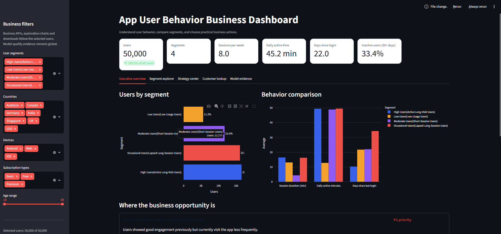

<details>
<summary>Business opportunity cards</summary>

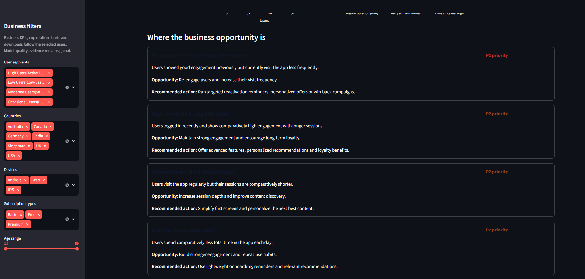

</details>

### Segment explorer

Each segment view displays its own KPI cards and a comparison against the selected-user average.

#### High Users(Active Long-Visit Users)

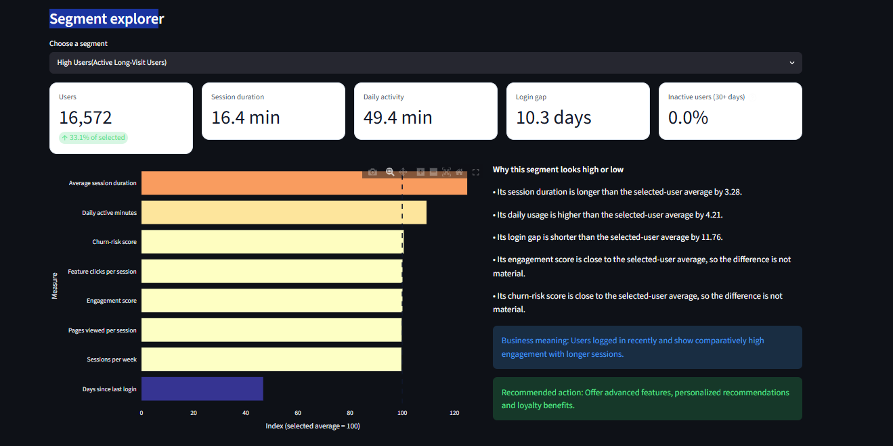

<details>
<summary>Subscription, device, and marketing-source breakdowns</summary>

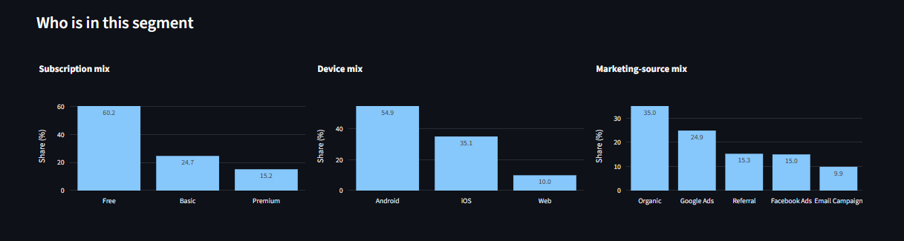

</details>

#### Low Users(Low-Usage Users)

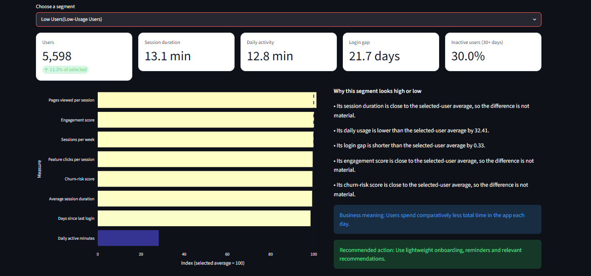

<details>
<summary>Subscription, device, and marketing-source breakdowns</summary>

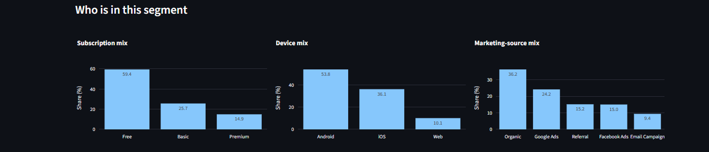

</details>

#### Moderate Users(Short-Session Users)

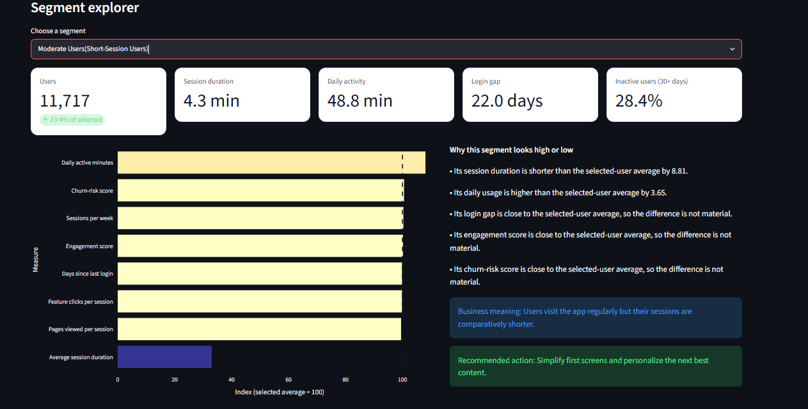

<details>
<summary>Subscription, device, and marketing-source breakdowns</summary>

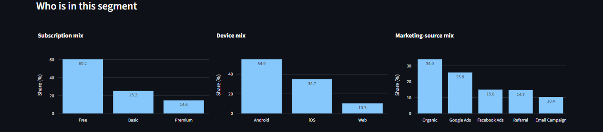

</details>

#### Occasional Users(Lapsed Long-Session Users)

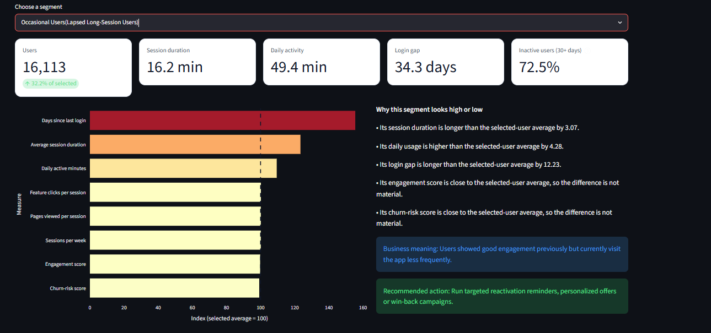

<details>
<summary>Subscription, device, and marketing-source breakdowns</summary>

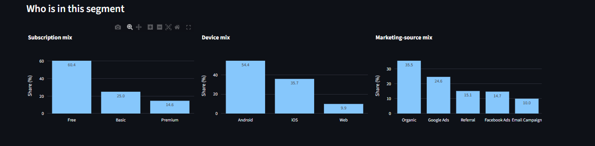

</details>

### Customer lookup and export

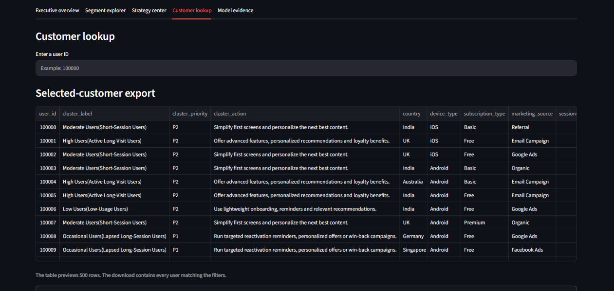

### Cluster visualization and model evidence

The PCA chart displays the final cluster assignments in two dimensions. The evaluation panel presents the selected cluster count and comparison evidence.

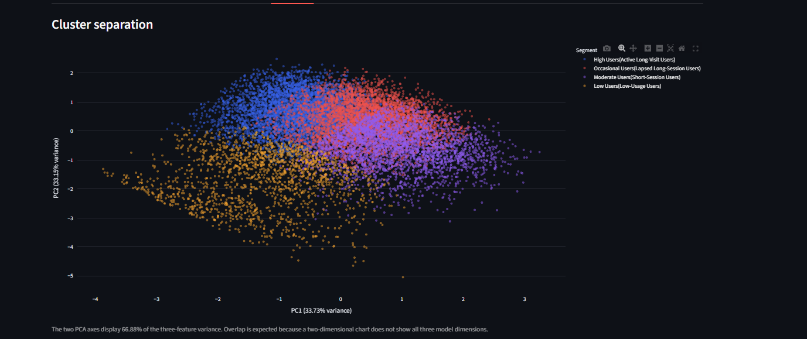

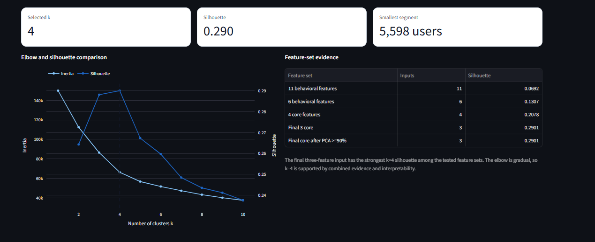

## Run the dashboard

Open a terminal in the repository folder. A virtual environment is recommended.

```bash
python -m venv .venv
```

Activate it on Windows PowerShell:

```powershell
.\.venv\Scripts\Activate.ps1
```

Or on macOS/Linux:

```bash
source .venv/bin/activate
```

Install the dashboard dependencies:

```bash
python -m pip install "streamlit>=1.50,<2" "pandas>=2.0,<4" "numpy>=1.24,<3" "plotly>=5.18,<7" "scikit-learn>=1.3,<2"
```

Ensure these five files are available in `results/`:

```text
users_with_clusters.csv
cluster_profile.csv
cluster_metrics.csv
feature_set_comparison.csv
pca_modeling_comparison.csv
```

The current loader reads all five files, including the PCA comparison CSV. Then start the app:

```bash
python -m streamlit run Dashboard.py
```

Open the local URL printed in the terminal. Both scripts resolve data paths relative to their own location.

## Regenerate the analysis

1. Place the original `app_user_behavior_dataset.csv` beside `Masterfile_final.py`.
2. Install the dashboard dependencies above plus Matplotlib:

   ```bash
   python -m pip install matplotlib
   ```

3. Address the existing optional profiling import before running. The current script contains `from data_profiling import ProfileReport`, although its report-generation calls are commented out. If that module is unavailable, remove or comment out this unused import. It is not required for clustering or the dashboard.
4. Run:

   ```bash
   python Masterfile_final.py
   ```

The script creates `results/`, writes the main CSV outputs, and displays analysis plots. Depending on the plotting backend, plot windows may need to be closed for execution to continue. It also produces a correlation heatmap HTML file, an elbow HTML file, and a scaling PNG; these are additional local artifacts beyond the CSV upload set.

**Reproducibility scope:** the current master script does not write `pca_modeling_comparison.csv`, `pca_loadings.csv`, or `final_k4_stability.csv`. These are included supplementary exports. Keep them with the uploaded results, but do not assume rerunning the current master script refreshes them. If the input data or model changes, regenerate the supplementary analysis before treating those files as current evidence.

Rerunning replaces matching per-cluster customer-list CSVs, so keep separate copies of any earlier results you want to retain.

## CSV output reference

| File in `results/` | Contents |
|---|---|
| `users_with_clusters.csv` | All users with original-unit reporting fields, cluster IDs, labels, meanings, opportunities, actions, and priorities |
| `cluster_profile.csv` | Segment sizes, business descriptions, priorities, and average profile measures |
| `cluster_metrics.csv` | Inertia, cluster sizes, and sampled silhouette results across cluster counts |
| `feature_set_comparison.csv` | Feature-set definitions, scaling checks, and model comparison scores |
| `df1_scaled.csv` | Standardized final model inputs |
| `feature_health.csv` | Numerical feature ranges, standard deviations, and distinct-value counts |
| `initial_outlier_report.csv` | Initial IQR bounds and outlier counts |
| `outlier_treatment_report.csv` | Treatment details and before/after outlier diagnostics |
| `cluster_<id>_<label>.csv` | Four separate user lists for segment-level exploration or campaign planning |
| `pca_modeling_comparison.csv` | Supplementary comparison of original and PCA-transformed model spaces |
| `pca_loadings.csv` | Supplementary first-two-component PCA loadings |
| `final_k4_stability.csv` | Supplementary adjusted Rand index comparisons across random seeds |

The supplied stability file reports adjusted Rand indices of approximately **0.987–1.000** against its reference clustering. This describes agreement across the recorded runs, not future user behavior or campaign effectiveness.

## Interpretation and limitations

- This is unsupervised behavioral segmentation, not a trained churn prediction system. No accuracy, precision, recall, or F1 claim is made.
- Engagement-score means are around 65 and rounded churn-risk means are 0.50 across segments. Labels should be explained using duration, daily usage, and recency rather than claims of strong score separation.
- “High” does not establish high revenue or customer lifetime value. “Lapsed” describes current login recency; this snapshot does not demonstrate a historical decline.
- `daily_active_minutes` is used as supplied. The CSV lacks `total_active_minutes`, `active_days`, and `observation_days`, so average minutes per active day and per calendar day are not derived.
- The PCA scatter plot is a partial view of a three-dimensional model; overlap in two dimensions is expected.
- Model selection reflects the tested feature sets and settings. Capping choices, alternative algorithms, and future data may change the segments.
- Proposed retention, loyalty, and onboarding actions require evaluation through subsequent experiments. The project does not measure their business impact.

## Author

**Vishal S**  
Machine Learning | Data Analytics | Python

[GitHub](https://github.com/Vishal2010s) · [LinkedIn](https://www.linkedin.com/in/vishal-s-60915216)
