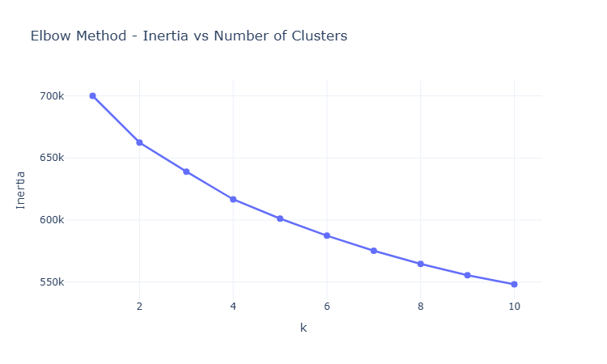
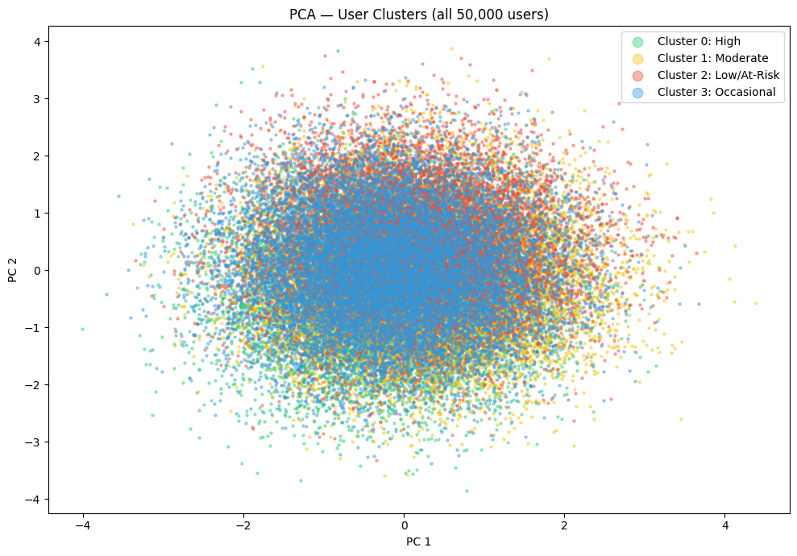
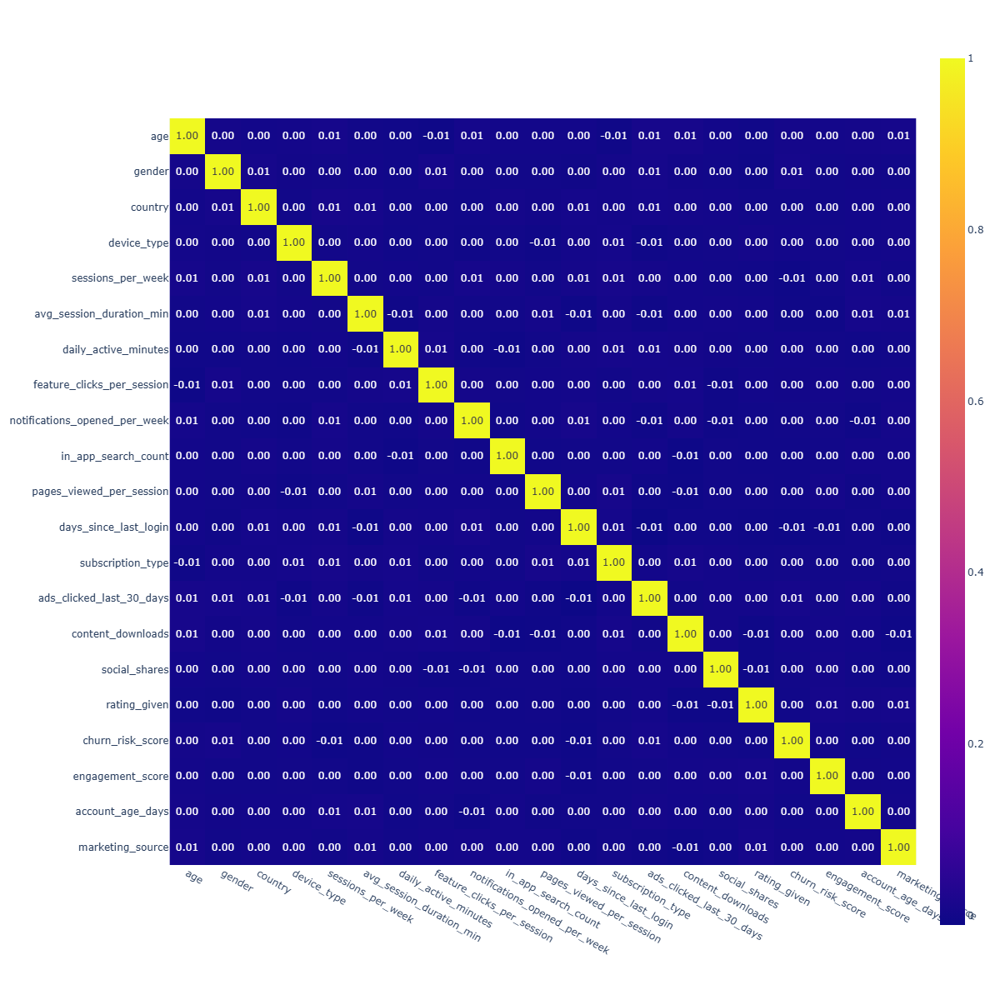

# 📱 App User Behavior Segmentation Using Unsupervised Machine Learning

---

# 📌 Executive Summary

Understanding how users interact with a mobile application is essential for improving customer engagement, reducing churn, and delivering personalized experiences.

This project applies **Unsupervised Machine Learning** to segment mobile application users into meaningful behavioral groups based on their usage patterns using K-Means clustering, enabling data-driven engagement, retention, and marketing strategies that a product / CRM team can act on.

The project demonstrates a complete end-to-end Machine Learning workflow including:

- Data Cleaning & Preprocessing
- Exploratory Data Analysis (EDA)
- Feature Engineering
- Feature Scaling
- K-Means Clustering
- Cluster Evaluation (Elbow method, Silhouette Score, PCA Visualization)
- Cluster Profiling
- Business Recommendation Generation

The final output provides actionable customer segments that can support product strategy, marketing personalization, and customer retention initiatives.

---

# 🎯 Project Objectives

The primary objectives of this project are:

- Analyze user behavior using application interaction data.
- Discover hidden behavioral patterns without labelled data.
- Segment users into meaningful customer groups.
- Evaluate clustering performance using multiple techniques.
- Interpret clusters from a business perspective.
- Recommend actionable strategies for each customer segment.

---

# 📑 Table of Contents

- [Executive Summary](#-executive-summary)
- [Project Objectives](#-project-objectives)
- [Business Problem](#-business-problem)
- [Business Use Cases](#-business-use-cases)
- [Dataset Overview](#-dataset-overview)
- [Project Workflow](#-project-workflow)
- [Project Architecture](#-project-architecture)
- [Key Project Results & Cluster Profiling](#-Key-Project-Results--cluster-profiling)
- [Business Insights](#-Business-Insights)
- [Visualizations](#-visualizations)
- [Author](#-author)

---

# 💼 Business Problem

Modern mobile applications collect millions of user interactions every day. While this data contains valuable information, organizations often struggle to identify meaningful behavioral patterns that can improve customer engagement and retention.

Without effective segmentation:

- Marketing campaigns become generic and less effective.
- Customer churn increases due to untargeted engagement.
- Product teams lack insights into feature adoption.
- High-value users cannot be identified efficiently.
- Customer experience remains largely one-size-fits-all.

Machine Learning provides a scalable approach to automatically discover behavioral patterns and group users with similar characteristics. These insights enable organizations to make informed business decisions and deliver more personalized user experiences.

---

# 🌟 Business Use Cases

This project demonstrates how behavioral segmentation can support real-world business decisions.

| Business Challenge | Machine Learning Solution | Expected Business Value |
|--------------------|---------------------------|-------------------------|
| High customer churn | Identify at-risk user segments | Improve customer retention |
| Low user engagement | Behavioral clustering | Increase active user participation |
| Generic marketing campaigns | Personalized customer groups | Higher campaign conversion rates |
| Feature adoption analysis | Engagement-based segmentation | Better product roadmap decisions |
| Customer loyalty | Identify highly engaged users | Reward valuable customers |
| Product optimization | Analyze interaction patterns | Improve application usability |
| Revenue growth | Personalized engagement strategies | Increase customer lifetime value |

---

# 📊 Dataset Overview

The project uses a mobile application user behavior dataset containing demographic information, engagement metrics, session activity, interaction patterns, and customer behavioral indicators.

### Dataset Highlights

| Attribute | Description |
|-----------|-------------|
| Records | Approximately 50,000 users *(update if your dataset differs)* |
| Features | Behavioral, demographic and engagement variables |
| Problem Type | Unsupervised Machine Learning |
| Target Variable | None |
| Machine Learning Algorithm | K-Means Clustering |
| Dimensionality Reduction | Principal Component Analysis (PCA) |

### Key Feature Categories

#### 👤 User Information

- Age
- Gender
- Device Type

#### 📱 User Activity

- Session Duration
- Sessions Per Week
- Daily Active Minutes

#### 🔔 User Engagement

- Feature Clicks
- Notification Opens
- In-App Searches

#### 📈 Business Metrics

- Engagement Score
- Churn Risk Score
- Account Age
- Days Since Last Login

---


# 🔄 Project Workflow

The project follows a structured Machine Learning pipeline to transform raw user behavior data into meaningful customer segments.

```text
                     Raw Dataset
                          │
                          ▼
             Data Understanding & Validation
                          │
                          ▼
              Data Cleaning & Preprocessing
                          │
                          ▼
            Missing Value & Outlier Handling
                          │
                          ▼
              Exploratory Data Analysis (EDA)
                          │
                          ▼
          Feature Engineering & Feature Selection
                          │
                          ▼
          Encoding & Data Standardization
                    (StandardScaler)
                          │
                          ▼
        Dimensionality Reduction (PCA)
                          │
                          ▼
        K-Means Clustering Algorithm
                          │
                          ▼
     Elbow Method & Silhouette Evaluation
                          │
                          ▼
         Cluster Profiling & Interpretation
                          │
                          ▼
        Business Recommendations & Insights
```

---

# 🏗 Project Architecture

The repository has been organized using a modular architecture to improve readability, maintainability, and code reusability.

```text
App-User-Behavior-Segmentation/
│
├── data/
│   ├── raw/
│   └── processed/
│
├── images/
│
├── notebooks/
│   └── App_User_Behavior_Segmentation.ipynb
│
├── reports/
│   └── figures/
│
├── src/
│   ├── __init__.py
│   ├── config.py
│   ├── preprocessing.py
│   ├── feature_engineering.py
│   ├── clustering.py
│   └── visualization.py
│
├── README.md
├── requirements.txt
└── .gitignore
```

### Module Responsibilities

| Module | Responsibility |
|---------|----------------|
| `config.py` | Stores project configurations and dataset paths |
| `preprocessing.py` | Data loading, missing value treatment, outlier detection and preprocessing |
| `feature_engineering.py` | Feature selection, encoding, correlation analysis and scaling |
| `clustering.py` | PCA, K-Means clustering, evaluation and cluster profiling |
| `visualization.py` | Visualizations including distribution plots, heatmaps and cluster plots |

---

# 📐 Feature Scaling

Machine Learning clustering algorithms are distance-based and therefore highly sensitive to differences in feature scales.

To ensure equal contribution from every numerical feature, **StandardScaler** was applied.

Benefits of scaling include:

- Preventing high-range variables from dominating the clustering process.
- Improving cluster separation.
- Enhancing PCA performance.
- Producing more stable K-Means results.

---

# 🧩 Dimensionality Reduction

Before visualizing clusters, **Principal Component Analysis (PCA)** was applied to reduce the high-dimensional feature space into two principal components.

### Why PCA?

- Simplifies visualization.
- Removes redundant variance.
- Preserves the majority of useful information.
- Makes cluster separation easier to interpret.

The resulting PCA projection provides a two-dimensional representation of user behavior while maintaining the overall clustering structure.

---
# 🤖 Unsupervised Machine Learning

## Why Unsupervised Learning?

Unlike supervised learning problems, this project does not contain predefined target labels. The objective is to automatically discover hidden behavioral patterns among application users.

To achieve this, **K-Means Clustering** was selected due to its simplicity, scalability, and effectiveness in customer segmentation tasks.

---

# 🎯 K-Means Clustering

K-Means partitions observations into **K distinct clusters** by minimizing the distance between each data point and its assigned cluster centroid.

The algorithm follows these steps:

1. Initialize K cluster centroids.
2. Assign each observation to its nearest centroid.
3. Recalculate centroid positions.
4. Repeat until cluster assignments stabilize.

The final output consists of groups of users exhibiting similar behavioral characteristics.

---

# 📏 Determining the Optimal Number of Clusters

Selecting an appropriate number of clusters is one of the most important steps in unsupervised learning.

This project evaluates multiple cluster sizes before selecting the final model.

## 1️⃣ Elbow Method

The Elbow Method was used to compare the Within Cluster Sum of Squares (WCSS) across different values of **K**.

As the number of clusters increases, WCSS decreases. The optimal K is identified where adding additional clusters produces only marginal improvement.

**Purpose**

- Reduce model complexity
- Avoid over-clustering
- Select an optimal K value

> 📌 Replace the figure below with your generated Elbow Method plot.

```text
images/
└── elbow_method.png
```

```markdown

```

---

## 3️⃣ PCA Validation

Since the original dataset contains many behavioral variables, **Principal Component Analysis (PCA)** was used to project the data into two dimensions for visualization.

PCA helps verify whether clusters are visually well separated.

> 📌 Replace the figure below with your PCA visualization.

```markdown

```

---

# 📊 Cluster Evaluation

Because this project is an **Unsupervised Machine Learning** problem, traditional supervised evaluation metrics such as Accuracy, Precision, Recall, and F1-Score are not applicable.

Instead, the clustering solution was evaluated using multiple complementary approaches.

| Evaluation Technique | Purpose |
|----------------------|----------|
| Elbow Method | Determine optimal number of clusters |
| PCA Visualization | Validate cluster separation visually |
| Cluster Profiling | Interpret behavioral differences |
| Business Validation | Assess practical usefulness of clusters |

This combination provides both quantitative and qualitative confidence in the clustering results.

---

# 👥 Cluster Profiling

After clustering, each user segment was analyzed using behavioral metrics such as:

- Engagement Score
- Churn Risk Score
- Session Duration
- Sessions Per Week
- Daily Active Minutes
- Feature Usage
- User Activity

Each cluster was then assigned a meaningful business interpretation.

---

# 🏆 Customer Personas

| Cluster | Persona | Characteristics | Recommended Action |
|----------|----------|-----------------|--------------------|
| Cluster 0 | High Engagement Users | High activity, strong engagement, low churn | Loyalty programs, premium offerings |
| Cluster 1 | Moderate Engagement Users | Regular activity with growth potential | Personalized recommendations and targeted promotions |
| Cluster 2 | At-Risk Users | Low engagement, higher churn probability | Retention campaigns and proactive customer outreach |
| Cluster 3 | Occasional Users | Infrequent usage and limited interaction | Re-engagement campaigns and awareness initiatives |

> **Note:** Replace the persona descriptions if your final cluster characteristics differ.

---

# 📈 Key Project Results

The project successfully segmented application users into meaningful behavioral groups.

### Key Outcomes

- Successfully cleaned and prepared behavioral data for clustering.
- Identified the optimal number of user segments using the Elbow Method and Silhouette Score.
- Reduced feature dimensionality using PCA for improved visualization.
- Generated meaningful user personas based on behavioral characteristics.
- Produced actionable business recommendations for each identified segment.

---

# 💡 Business Insights

The resulting customer segments provide valuable insights that can support strategic decision-making.

### Marketing

- Deliver personalized marketing campaigns.
- Improve campaign conversion rates.
- Increase customer engagement.

### Customer Retention

- Identify users at risk of churn.
- Launch targeted retention strategies.
- Improve long-term customer loyalty.

### Product Management

- Understand feature adoption patterns.
- Prioritize feature enhancements.
- Improve overall user experience.

### Business Strategy

- Optimize customer segmentation.
- Allocate marketing resources efficiently.
- Increase Customer Lifetime Value (CLV).

---

# 📊 Project Visualizations

The following visualizations were generated during the analysis.

## 📷 Sample Outputs

### Correlation Heatmap

```markdown

```

---

### PCA Cluster Visualization

```markdown

```

---

### Elbow Method

```markdown

```

---

### Cluster Distribution

```markdown

```

---

# 📦 Project Dependencies

The project was developed using the following Python libraries:

| Library | Purpose |
|----------|---------|
| Pandas | Data manipulation and analysis |
| NumPy | Numerical computing |
| Scikit-learn | Machine Learning |
| Matplotlib | Static visualizations |
| Seaborn | Statistical visualization |
| Plotly | Interactive visualizations |
| SQLAlchemy | Database connectivity (if applicable) |
| ydata-profiling | Automated exploratory data profiling |


---

# 👨‍💻 Author

## Vishal S

**Machine Learning | Data Analytics | Python**

I enjoy building data-driven solutions that transform raw data into meaningful business insights. This project demonstrates an end-to-end unsupervised machine learning workflow, from data preprocessing and exploratory analysis to customer segmentation and business recommendations.

### Connect with Me

**GitHub**

https://github.com/Vishal2010s

**LinkedIn**

https://www.linkedin.com/in/vishal-s-60915216

---


# ⭐ Support

If you found this project useful or interesting:

- ⭐ Star this repository.
- 🍴 Fork it to explore or extend the workflow.
- 💡 Share suggestions or improvements through GitHub Issues.

Thank you for visiting this repository!
